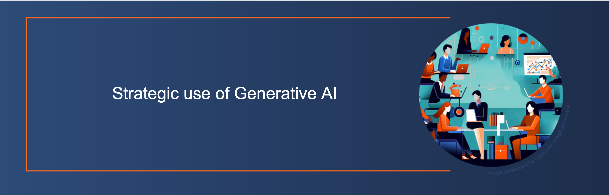

<!--

author:   Alexander Botzki, Bruna Piereck
email:    training@vib.de
version:  1.0.0
language: en
narrator: UK English Female

icon:     https://vib.be/sites/vib.sites.vib.be/files/logo_VIB_noTagline.svg

comment:  This document shall provide an entire compendium and course on the
          development of Open-courSes with [LiaScript](https://LiaScript.github.io).
          As the language and the systems grows, also this document will be updated.
          Feel free to fork or copy it, translations are very welcome...

script:   https://cdn.jsdelivr.net/chartist.js/latest/chartist.min.js
          https://felixhao28.github.io/JSCPP/dist/JSCPP.es5.min.js

link:     https://cdn.jsdelivr.net/chartist.js/latest/chartist.min.css
link:     https://cdnjs.cloudflare.com/ajax/libs/animate.css/4.1.1/animate.min.css
link:     https://raw.githubusercontent.com/vibbits/material-liascript/master/img/org.css
link:     https://cdnjs.cloudflare.com/ajax/libs/font-awesome/5.11.2/css/all.min.css
link:     https://fonts.googleapis.com/css2?family=Saira+Condensed:wght@300&display=swap
link:     https://fonts.googleapis.com/css2?family=Open+Sans&display=swap
link:     https://raw.githubusercontent.com/vibbits/material-liascript/master/vib-styles.css

tutor:    Strategic use of Generative AI
edition:  1st 

@JSONLD
<script run-once>
  let json = @0 

  const script = document.createElement('script');
  script.type = 'application/ld+json';
  script.text = JSON.stringify(json);

  document.head.appendChild(script);

  // this is only needed to prevent and output,
  // as long as the result of a script is undefined,
  // it is not shown or rendered within LiaScript
  console.debug("added json to head")
</script>
@end

orcid:    [@0](@1)<!--class="orcid-logo-for-author-list"-->
-->

# Course Title

```json   @JSONLD
{
  "@context": "https://schema.org/",
  "@type": "LearningResource",
  "@id": "https://elixir-europe-training.github.io/ELIXIR-TrP-TeSS/",
  "http://purl.org/dc/terms/conformsTo": {
    "@type": "CreativeWork",
    "@id": "https://bioschemas.org/profiles/TrainingMaterial/1.0-RELEASE"
  },
  "description": "Strategic Use of Generative AI - this is our hands-on course for general use and research-specific use of Generative AI.",
  "keywords": "FAIR, OPEN, Generative AI, Writing, Ethics, Scripting",
  "name": "Strategic Use of Generative AI",
  "license": "https://creativecommons.org/licenses/by/4.0/",
  "educationalLevel": "beginner",
  "competencyRequired": "none",
  "teaches": [
    "Providing a background of the evolution of generative AI models",
    "Providing an overview of the features and capabilities of genAI",
    "Analysing prompt engineering techniques for different purposes",
    "Exploring several applications of genAI in academic research (afternoon session)", 
    "Providing hands-on experience with using different genAI tools for work and research purposes",
    "Critically evaluating the AI generated outcomes"
  ],
  "audience": "researchers",
  "inLanguage": "en-US",
  "learningResourceType": [
    "tutorial"
  ],
  "author": [
    {
      "@type": "Person",
      "name": "Bruna Piereck"
    },
    {
      "@type": "Person",
      "name": "Alexander Botzki"
    }
  ],
  "contributor": [
    {
      "@type": "Person",
      "name": "Christof De Bo"
    }
  ]
}
```


<section>

Hello and welcome to our @tutor workshop! We are very happy to have you here.

This is the @edition edition of this workshop, jointly organised by VIB and ELIXIR.



Example image to ilustrate the front page of the material. This image was designed by Bruna Piereck.

> We are using the interactive Open Educational Resource online/offline course infrastructure called LiaScript.
> It is a distributed way of creating and sharing educational content hosted on github.
> To see this document as an interactive LiaScript rendered version, click on the
> following link/badge: [LiaScript](https://liascript.github.io/course/?https://raw.githubusercontent.com/vibbits/training_material_template/main/README.md)

## General context

Over the last few months, the rapid establishment of generative AI and Large Language Models (LLM) has opened new frontiers in a variety of domains. This hands-on class aims to provide you the necessary skills to effectively use this cutting-edge technology in a interdisciplinary way. With two formats of participation possible, we wish to offer opportunities for everyone to build enough knowledge to a variety of applications. In the morning you will follow an introduction on ethics, ownership and general hands-on application of generative AI that can be used holistically. This is meant for anyone including admin, support, and others to use for their work or personal interests. After a general view, we will navigate deeper in the use of generative AI for research, from scientific writing to analysis, we will introduce how genAI can be supportive in this process. We will cover different aspects of using ChatBots powered with LLMs, including the ethical and ownership aspects, the theoretical background and several examples of practical application among which how to strategically prompt your request for text generation in any context, how to generate high-quality content for research papers, and grant applications.

The **presentations** which goes alongside this material can be found [in the Lesson overview: Slides](#2) .

## Proposed Schedule

Schedule day 1:

- 9:30 - 11:00 - session Introduction to Generative AI
   - Brief historical background: from first AI to generative AI
   - Mapping generative AI tools
   - Focus on Large Language Models (LLMs)
- 11:00 - 11:15 - break
- 11:15 - 12:45 - session Introduction to Generative AI
   - Tools for genAI (CoPilot, Perplexity and other competitors)
   - Prompt engineering
   - Ethical considerations
   - Ownership, copyright and authenticity
- 12:45 - 13:45 - lunch
- 13:45 - 15:15 - session Generative AI for Writing
   - Conducting a literature review
   - Finding research gaps
   - Writing an article (storytelling, etc.)
   - Presenting the outcome
- 15:15 - 15:30 - break
- 15:30 - 17:00 - session Generative AI for Scripting
   - Doing quantitative research

</section>

# Lesson overview

> <i class="fa fa-lock"></i> **License:** [Creative Commons Attribution 4.0 International  License](https://creativecommons.org/licenses/by/4.0/deed.en)
>
> <i class="fa fa-user"></i> **Target Audience:** Researchers
>
> <svg xmlns="http://www.w3.org/2000/svg" height="14" width="16" viewBox="0 0 576 512"><!--!Font Awesome Free 6.5.1 by @fontawesome - https://fontawesome.com License - https://fontawesome.com/license/free Copyright 2023 Fonticons, Inc.--><path d="M384 64c0-17.7 14.3-32 32-32H544c17.7 0 32 14.3 32 32s-14.3 32-32 32H448v96c0 17.7-14.3 32-32 32H320v96c0 17.7-14.3 32-32 32H192v96c0 17.7-14.3 32-32 32H32c-17.7 0-32-14.3-32-32s14.3-32 32-32h96V320c0-17.7 14.3-32 32-32h96V192c0-17.7 14.3-32 32-32h96V64z"/></svg> **Level:** Beginner  
>
> <i class="fa fa-arrow-left"></i> **Prerequisites**  
> To be able to follow this course, learners should have knowledge in:
> 
> 1. No prior knowledge of Machine Learning or coding expertise is required
> 2. Basic knowledge of R could be beneficial
> 3. Being comfortable working with the web browser  
>
> <i class="fa fa-bookmark"></i> **Description**  Over the last few months, the rapid establishment of generative AI and Large Language Models (LLM) has opened new frontiers in a variety of domains. This hands-on class aims to provide you the necessary skills to effectively use this cutting-edge technology in a interdisciplinary way. With two formats of participation possible, we wish to offer opportunities for everyone to build enough knowledge to a variety of applications. In the morning you will follow an introduction on ethics, ownership and general hands-on application of generative AI that can be used holistically. This is meant for anyone including admin, support, and others to use for their work or personal interests. After a general view, we will navigate deeper in the use of generative AI for research, from scientific writing to analysis, we will introduce how genAI can be supportive in this process. We will cover different aspects of using ChatBots powered with LLMs, including the ethical and ownership aspects, the theoretical background and several examples of practical application among which how to strategically prompt your request for text generation in any context,  how to generate high-quality content for research papers, and grant applications.
> 
> <i class="fa fa-arrow-right"></i> **Learning Outcomes:**  
> By the end of the course, learners will be able to:
>
> 1. Providing a background of the evolution of generative AI models
> 2. Providing an overview of the features and capabilities of genAI
> 3. Analysing prompt engineering techniques for different purposes
> 4. Exploring several applications of genAI in academic research (afternoon session) 
> 5. Providing hands-on experience with using different genAI tools for work and research purposes
> 6. Critically evaluating the AI generated outcomes
>
>> Check more about [Bloom's taxonomy](https://cft.vanderbilt.edu/guides-sub-pages/blooms-taxonomy/) to categorize the levels in educational goals
>
> <i class="fa fa-hourglass"></i> **Time estimation**: 360 minutes
>
> <i class="fa fa-asterisk"></i> **Requirements:** The (technical) installation requirements are described in the Chapters overview section Getting ready.
>
> <i class="fa fa-envelope-open-text"></i> **Supporting Materials**:
> 
> 1. [Exercises and solutions](https://github.com/vibbits/introduction-to-generative-ai)
> 2. [Slides morning]()
> 3. [Slides afternoon]()  
> 
> <i class="fa fa-life-ring"></i> **Acknowledgement**:
>
> * [ELIXIR Belgium](https://www.elixir-belgium.org/)
> * [VIB Technologies](https://www.vib.be/)
>
> <i class="fa fa-money-bill"></i> **Funding:** This project has received funding from VIB.
>
> <i class="fa fa-anchor"></i> **PURL**:  


# Authors and Contributors

Authors

- [Bruna Piereck](@[orcid](https://orcid.org/0000-0001-5958-0669)
- [Alexander Botzki](@[orcid](https://orcid.org/0000-0001-6691-4233)

Contributors

- we welcome contributors for these materials

## Citing this lesson

Please cite as:

  1. to be added once we have released the first version

# Chapters List

| Chapter | Title                                                   |
| :---- | :------------------------------------------------         |
| 0     | [Get ready for the course, instalation and pre-reading](https://liascript.github.io/course/?https://raw.githubusercontent.com/vibbits/introduction-to-generative-ai/refs/heads/main/Chapters/GetReady4training.md) |
| 1     | [Strategic use of generative AI for all](https://liascript.github.io/course/?https://raw.githubusercontent.com/vibbits/introduction-to-generative-ai/refs/heads/main/Chapters/Chapter01.md)                                             |
| 2     | [Strategic use of generative AI for research](https://liascript.github.io/course/?https://raw.githubusercontent.com/vibbits/introduction-to-generative-ai/refs/heads/main/Chapters/Chapter02.md)                                             |


# References

Here are some great tips for learning and to get inspired for writing your own pipelines:

- to be added after the course

# About us

*About ELIXIR Training Platform*

The ELIXIR Training Platform was established to develop a training community that spans all ELIXIR member states (see the list of Training Coordinators). It aims to strengthen national training programmes, grow bioinformatics training capacity and competence across Europe, and empower researchers to use ELIXIR's services and tools.

One service offered by the Training Platform is TeSS, the training registry for the ELIXIR community. Together with ELIXIR France and ELIXIR Slovenia, VIB as lead node for ELIXIR Belgium is engaged in consolidating quality and impact of the TeSS training resources (2022-23) (https://elixir-europe.org/internal-projects/commissioned-services/2022-trp3).

The Training eSupport System was developed to help trainees, trainers and their institutions to have a one-stop shop where they can share and find information about training and events, including training material. This way we can create a catalogue that can be shared within the community. How it works is what we are going to find out in this course.

*About VIB and VIB Technologies*

VIB is an entrepreneurial non-profit research institute, with a clear focus on groundbreaking strategic basic research in life sciences and operates in close partnership with the five universities in Flanders – Ghent University, KU Leuven, University of Antwerp, Vrije Universiteit Brussel and Hasselt University.

As part of the VIB Technologies, the 12 VIB Core Facilities, provide support in a wide array of research fields and housing specialized scientific equipment for each discipline. Science and technology go hand in hand. New technologies advance science and often accelerate breakthroughs in scientific research. VIB has a visionary approach to science and technology, founded on its ability to identify and foster new innovations in life sciences.

The goal of VIB Technology Training is to up-skill life scientists to excel in the domains of VIB Technologies, Bioinformatics & AI, Software Development, and Research Data Management.

--------------------------------------------

*Editorial team for this course*

Authors: @[orcid(Alexander Botzki)](https://orcid.org/0000-0001-6691-4233), @[orcid(Bruna Piereck)](https://orcid.org/0000-0001-5958-0669)

Technical Editors: Alexander Botzki

License: [](https://creativecommons.org/licenses/by-sa/4.0/deed.en)

